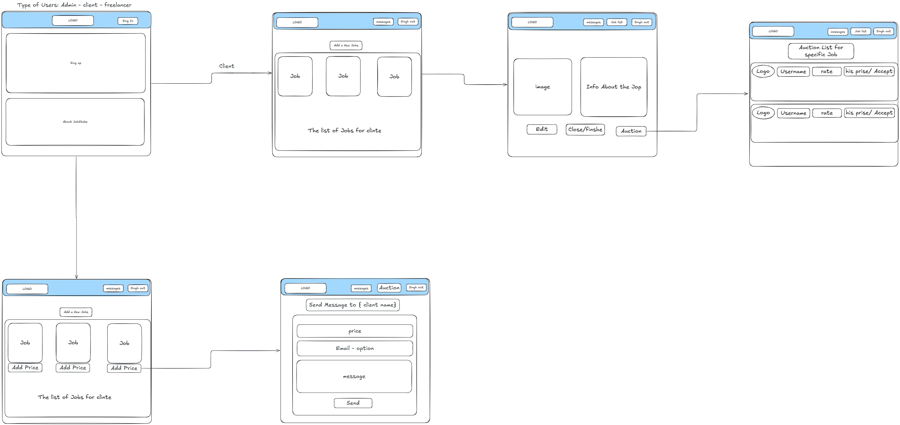

# JobStack

## General Users

#### 1. Create Account  
As a new user, I want to easily create a new account,  
so that I can access personalized features such as a favorites list.

#### 2. Log In  
As a registered user, I want to log in to my account,  
so that I can view and manage my personal data.

#### 3. Log Out  
As a logged-in user, I want to log out of my account,  
so that my account stays secure when I’m not using the platform.

## Client User Stories

#### 1. Create Job Listing  
As a Client, I want to create a new job listing,  
so that freelancers can view it and submit offers for the project.

#### 2. Edit Job Listing  
As a Client, I want to edit the details of an existing job listing,  
so that the information remains accurate, relevant, and up to date.

#### 3. Update Job Status  
As a Client, I want to update the status of a job listing (e.g., Open or Closed),  
so that freelancers know whether the job is still available.

#### 4. View Freelancer Rating  
As a Client, I want to view the freelancer’s rating (1–5) when they message me,  
so that I can quickly assess their reliability and previous performance.

## Freelancer User Stories

#### 1. Browse All Jobs  
As a Freelancer, I want to browse and view all job listings (open and closed),  
so that I can understand available opportunities and project history.

#### 2. View Job Details  
As a Freelancer, I want to view complete job details, including required skills and specs,  
so that I can determine whether I’m a good fit for the job.

#### 3. Submit Offers  
As a Freelancer, I want to submit offers or proposals for open jobs,  
so that I can apply for projects that match my skillset.

#### 4. Communicate With Client  
As a Freelancer, I want to communicate directly with the job owner (live chat or email),  
so that I can discuss project requirements and clarify details easily.

## Wireframes: 

## Relationship Diagram  
[Click to view ERD](https://lucid.app/lucidchart/ae1d837c-aabc-4dec-843c-ef9942e76452/edit?viewport_loc=1304%2C-2065%2C2064%2C2060%2C0_0&invitationId=inv_9b11109b-bbcc-4d1c-8f41-9cef5d146ea8)

## Technologies Used

#### 1. **JavaScript**  
Used for both client-side and server-side functionality.

#### 2. **HTML**  
Provides the structure and layout of the web pages.

#### 3. **CSS**  
Responsible for styling the application.

#### 4. **Express.js**  
Framework used to build the backend server and manage routes.

#### 5. **Multer**  
Middleware for handling file uploads such as images.

#### 7. **MongoDB**  
NoSQL database used to store and manage application data.

#### 8. **Mongoose**  
Used to define schemas and interact with the MongoDB database.

## Future work 
1. admin page and dashboard
2. adding the project after its done

## Trello 
https://trello.com/b/4ptsB6SO/jobstack

## Deployment 
https://job-stack-front-end.vercel.app/

## Authors
Zainab Moosa - https://github.com/zma8
Ali Qambar
Zainab Mohammed
 
